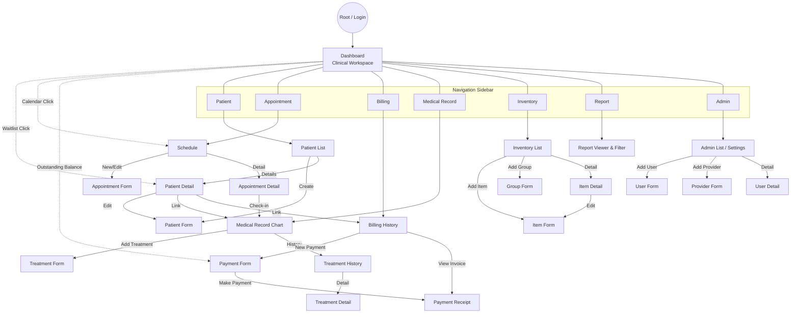

# Screen Flow Diagram

```mermaid
graph TD
    %% Main Entry Point
    Root((Root / Login)) --> Dashboard[Dashboard<br>Clinical Workspace]
    
    %% Dashboard Quick Links
    Dashboard -.->|Waitlist Click| PatientDetail[Patient Detail]
    Dashboard -.->|Calendar Click| Schedule[Schedule]
    Dashboard -.->|Outstanding Balance| PaymentForm[Payment Form]

    %% Navigation Menu
    subgraph Navigation Sidebar
        NavPatient[Patient]
        NavAppt[Appointment]
        NavBilling[Billing]
        NavMR[Medical Record]
        NavInv[Inventory]
        NavReport[Report]
        NavAdmin[Admin]
    end
    
    Dashboard --- NavPatient
    Dashboard --- NavAppt
    Dashboard --- NavBilling
    Dashboard --- NavMR
    Dashboard --- NavInv
    Dashboard --- NavReport
    Dashboard --- NavAdmin

    %% Patient Flow
    NavPatient --> PatientList[Patient List]
    PatientList -->|Create| PatientForm[Patient Form]
    PatientList -->|Details| PatientDetail
    PatientDetail -->|Edit| PatientForm
    PatientDetail -->|Link| MRChart[Medical Record Chart]
    PatientDetail -->|Link| PaymentHistory[Billing History]

    %% Appointment Flow
    NavAppt --> Schedule
    Schedule -->|New/Edit| ScheduleForm[Appointment Form]
    Schedule -->|Detail| ScheduleDetail[Appointment Detail]
    ScheduleDetail -->|Check-in| MRChart

    %% Medical Record Flow
    NavMR --> MRChart
    MRChart -->|Add Treatment| MRForm[Treatment Form]
    MRChart -->|History| MRHistory[Treatment History]
    MRHistory -->|Detail| MRDetail[Treatment Detail]

    %% Billing Flow
    NavBilling --> PaymentHistory
    PaymentHistory -->|New Payment| PaymentForm
    PaymentForm -->|Make Payment| PaymentPreview[Payment Receipt]
    PaymentHistory -->|View Invoice| PaymentPreview

    %% Inventory Flow
    NavInv --> InvList[Inventory List]
    InvList -->|Add Item| InvItemForm[Item Form]
    InvList -->|Add Group| InvGroupForm[Group Form]
    InvList -->|Detail| InvDetail[Item Detail]
    InvDetail -->|Edit| InvItemForm

    %% Report Flow
    NavReport --> ReportViewer[Report Viewer & Filter]

    %% Admin Flow
    NavAdmin --> AdminList[Admin List / Settings]
    AdminList -->|Add User| AdminUserForm[User Form]
    AdminList -->|Add Provider| AdminProviderForm[Provider Form]
    AdminList -->|Detail| AdminUserDetail[User Detail]
```
